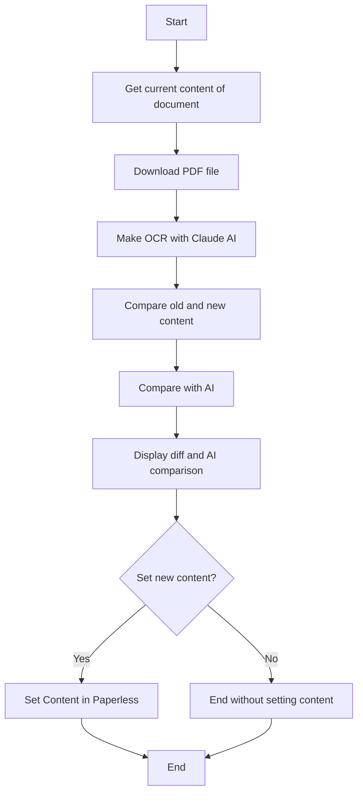

# AnthropicPaperOCR

An Anthropic API powered CLI to OCR PDF files and compare the results with the current content of a document in a Paperless instance. And set the new content in the Paperless instance if the user decides to do so.

```bat 
anthropicpaperocr.exe -document_id 437 -api_key_paperless xxx -api_key_anthropic yyy -host_header paperless.example.org -url http://192.168.1.1:8080
```

## Gettings Started

### Prerequisites

- API Key for the Paperless instance
- API Key for the Anthropic API
- Host Header for the Paperless instance, sometimes necessary for the API if the instance is behind a reverse proxy
- URL of the Paperless instance
- Document ID of the document to be processed

## Program Flow


