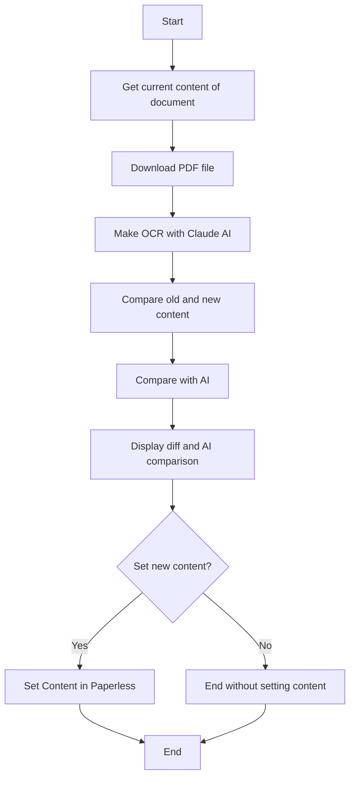

# AnthropicPaperOCR

An Anthropic API powered CLI to OCR PDF files and compare the results with the current content of a document in a Paperless instance. And set the new content in the Paperless instance if the user decides to do so.

The results are better than the default OCR with Tessaract, but the data will leave your network and go to the Anthropic API.

## Why Antrhopic?

Because Sonnet 3.5 analyzes both the text and images to better understand the document, and this is at this moment the only API that can do this at this level of quality. It used `claude-3-5-sonnet-20241022` but will updated as soon as a new version is available.

## Usage

```bat 
anthropicpaperocr.exe -document_id 437 -api_key_paperless xxx -api_key_anthropic yyy -host_header paperless.example.org -url http://192.168.1.1:8080
```

> ⚠️ Warning: You will send you document content to the Anthropic API. Please make sure you are allowed to do so!

> ⚠️ Warning: This is a proof of concept and not production ready!

> ⚠️ Warning: The will overwrite the content of the document in the Paperless instance if you decide to do so!

## Where is the binary?

You can download the binary from the [releases page](https://github.com/dhcgn/anthropic-paperless-ngx-ocr/releases/), build it yourself or go to the workflow runs and download the artifact from the last run.

## Gettings Started

### Prerequisites

- API Key for the Paperless-NGX instance, go to [Paperless-NGX Documentation](https://docs.paperless-ngx.com/)
- API Key for the Anthropic API, go to [Anthropic API Getting Started](https://docs.anthropic.com/en/api/getting-started)
- *Optional:* Host Header for the Paperless instance, sometimes necessary for the API if the instance is behind a reverse proxy
  - Like running Paperless under 192.168.0.1:8080 and accessing it via paperless.example.org, then the host header is paperless.example.org
- URL of the Paperless instance, like http://192.168.0.1:8080 
- Document ID of the document to be processed, can see in the URL of the document in the Paperless instance

## Program Flow


